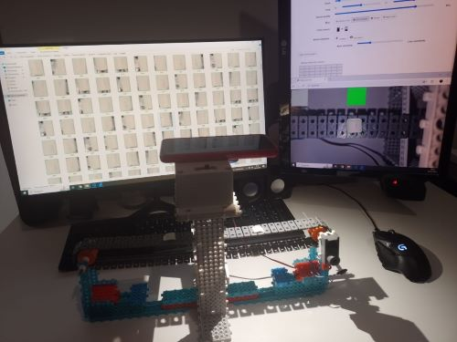
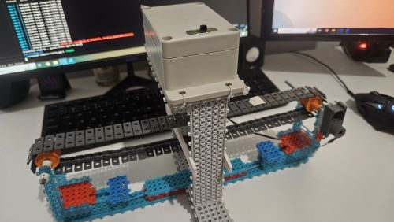

# computer-vision

This project aims to test the Python's computer vision resources. 

The idea is to capture the image from a wifi camera, process it using OpenCV and return it to the website through a websocket.

Zoom: 1x

Stream quality: 85%

Focus mode: Manually set 10/m

